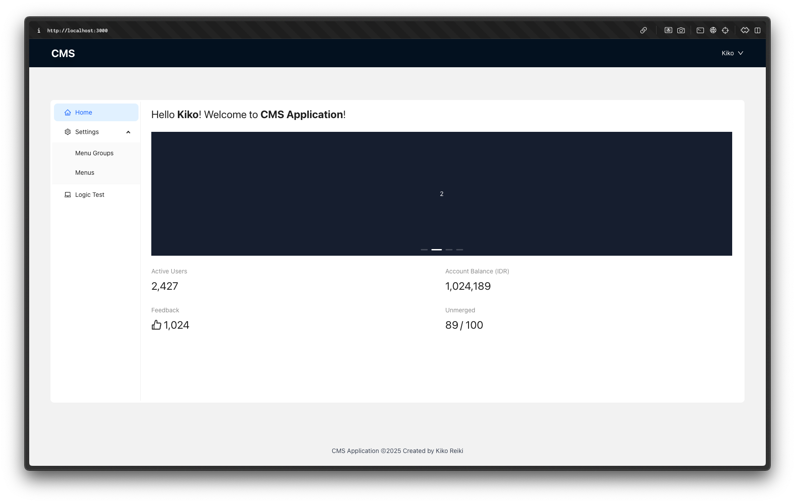

# 🧠 CMS App – Take Home Frontend Test

A **CMS (Content Management System)** application built with **Next.js**, **TypeScript**, **Zustand**, **Tailwind CSS**, and **Ant Design**. It includes authentication, settings management, a logic test playground, and a fully responsive layout.

---

## 🚀 Features

### ✅ Authentication
- **Simple login** using a hardcoded password (`admin`).
- Users can input any **username**, which will be shown in the navbar.
- Includes a **logout flow** with a 2-second delay and loading spinner.

### ✅ Routing
- **Home Page**: Displays a welcome message.
- **Settings Page**
    - **Menu Groups**: Add, list, and delete menu groups.
    - **Menus**: Add, list, and delete menus tied to a menu group.
- **Logic Test Page**: Validate programming test cases interactively (addition).

### ✅ State Management
- Uses **Zustand** to manage:
    - Auth state
    - Menu groups and menus
- Data is persisted in **localStorage**.

### ✅ UI & Styling
- **Responsive** layout for mobile, tablet, and desktop.
- Sidebar transforms into **top navigation** on mobile view.
- Styled with **Tailwind CSS** and **Ant Design** components.

### ✅ Developer Utilities
- **Form Validation** using simple validation logic and clear feedback.
- **Route change loading indicator** using `nprogress`.

---

## 🧠 Logic Test Playground

Available under the menu: **Logic Test > Name Validator**
- Validates names with 2 or 3 terms.
- Checks for initials, words, casing, dot usage, and invalid combinations.
- Provides **reasons** when validation fails.

---

## 🗂 Project Structure

```
cms-app/
├── public/
├── src/
│   ├── app/
│   │   ├── login/              # Login page
│   │   ├── settings/
│   │   │   ├── menuGroups/     # Menu Group Management page
│   │   │   └── menus/          # Menu Management page
│   │   ├── logic/              # Logic Test routes
│   │   └── globals.css         # Tailwind + Ant styles
│   │   └── page.tsx            # Home page
│   ├── components/
│   │   └── AppLayout.tsx       # Layout with Header + Sidebar
│   ├── hooks/
│   │   └── useHasHydrated.ts   # Hooks to prevent Hydration Failed
│   ├── stores/
│   │   ├── authStore.ts        # Auth logic with Zustand
│   │   └── settingsStore.ts    # Menu group/menu store
├── tsconfig.json
└── README.md
```

---

## 📦 Tech Stack

- [Next.js](https://nextjs.org/)
- [TypeScript](https://www.typescriptlang.org/)
- [Zustand](https://zustand-demo.pmnd.rs/)
- [Tailwind CSS](https://tailwindcss.com/)
- [Ant Design](https://ant.design/)
- [nprogress](https://www.npmjs.com/package/nprogress)

---

## 🛠 Installation & Setup

```bash
# 1. Clone the repository
git clone https://github.com/reikiko/cms-app.git
cd cms-app

# 2. Install dependencies
npm install

# 3. Run development server
npm run dev

# 4. Build server
npm run build

# 5. Run server
npm run start
```

The app will be available at: `http://localhost:3000`

---

## 🔑 Hardcoded Login

Use the following to log in:

- **Username**: Any name (will appear in navbar)
- **Password**: `admin`

---

## 💾 Data Persistence

- Menu Groups, Menus, and Auth status are stored in **localStorage**.
- On page reload, the state is restored automatically.

---

## 📱 Responsive Design

- Desktop: Sidebar + main layout
- Mobile: Top navigation with horizontal menu
- Ant Design + Tailwind CSS used for responsive UI components

---

## 🧪 Logic Test Cases (Playground)

Includes a live playground to test the following logic problem:

### 1. Name Validator

- Supports terms as **initials (e.g., I.)** or **words (e.g., Ivan)**.
- Validates formats like: `I. Septian`, `Ivan T. Septian`, `Ivan Tri Septian`, etc.
- Rejects names with incorrect capitalization, bad formats, or invalid structures.
- Displays **reason** for failure clearly (addition).

#### ✅ Valid Examples
- `I. Tri`
- `I. T. Septian`
- `Ivan T. Septian`
- `Ivan Tri Septian`

#### ❌ Invalid Examples
| Invalid Name           | Reason                                                                 |
|------------------------|------------------------------------------------------------------------|
| Ivan                 | Must contain 2 or 3 terms                                              |
| I Tri                | Initials must end with a dot                                           |
| I. T Septian         | Initials must end with a dot                                           |
| i. Tri               | Incorrect capitalization                                               |
| I. septian           | Incorrect capitalization                                               |
| i. t. Septian        | Incorrect capitalization                                               |
| I. Tri Septian       | Cannot have: initial first + word middle                               |
| I. T. S.             | Last name cannot be an initial                                         |
| Ivan. Tri Septian    | Dot not allowed after a word                                           |

---

## 🧹 Linting & Formatting

You can optionally add linting:

```bash
npm install -D eslint prettier eslint-config-next
npx eslint .
```

---

## 📄 License

© 2025 Kiko Reiki

---
